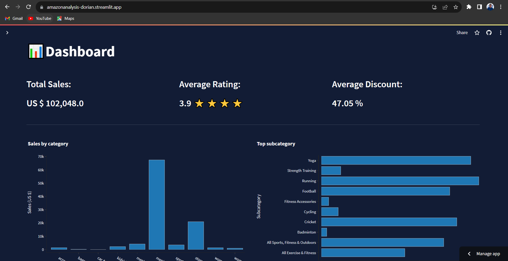
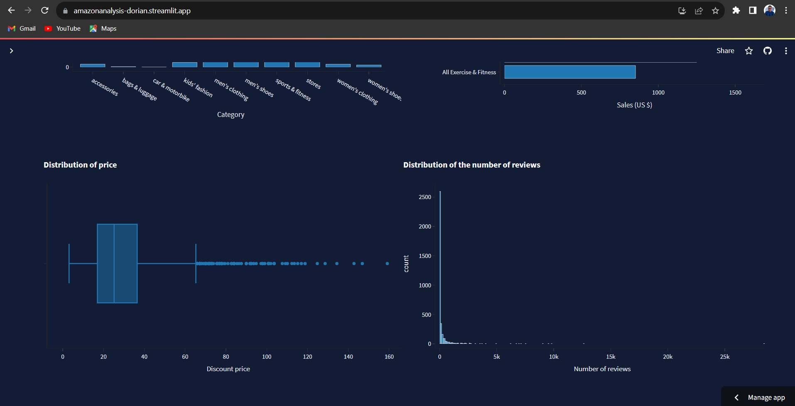

# Amazon products analysis 
## Summary
In this project,we analyzed the KPIs of the TOP Amazon manufacturers. 
We focused on : 
* Ratings
* Number of reviews
* Price
* Discount percentage
* Relationship between discount percentage and number of reviews
* Top categories
* Top subcategories
The notebook file amazon_product_analysis.ipynb contains more details about the project and the entire analysis. 
(warning : the two plots made with the plotly library(distribution of price and distribution of number of reviews) are missing from the notebook,  you can check those in the same notebook on my Kaggle  https://www.kaggle.com/code/doriancurtis/amazon-products-analysis/notebook)

## Web app 
I also built a webapp using the streamlit library, to showcase the performance of the top10 manufacturers on Amazon. 
### First page 

 * In first barchart, we can see the total sales by category 
 * The second is for the total sales by subcategory (and you have to a select category in the filter)
 * In the third graph (boxplot), we can see the distribution of price for each product and the outliers
 * And the last graph(histogram) is to show the distribution of the number of reviews.

### Second page 

